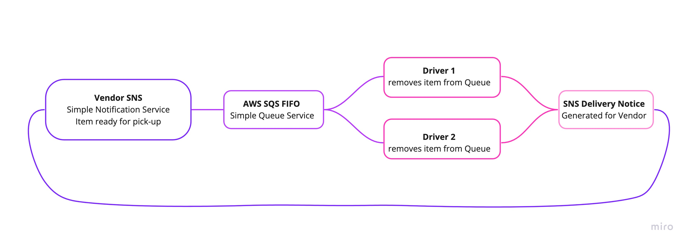
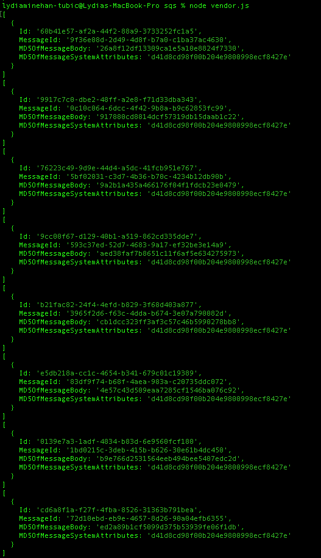
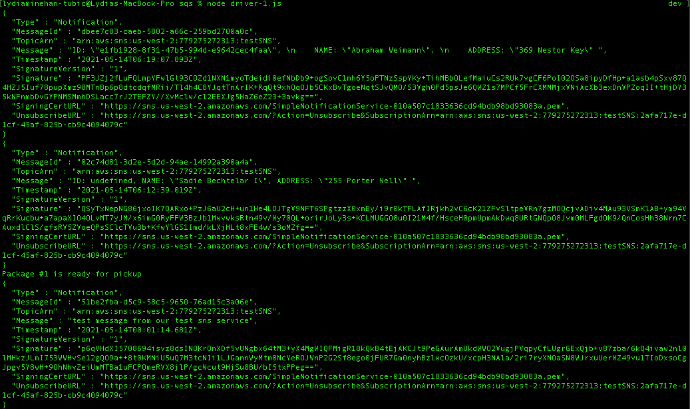
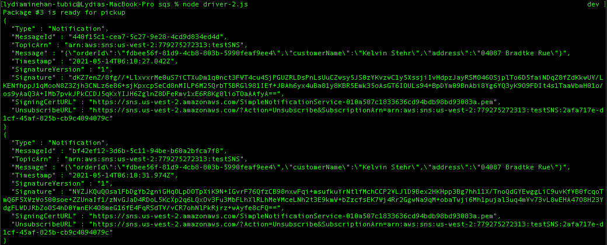

# Lab 19 | AWS: Events | 401 JavaScript
# Author: Lydia Minehan-Tubic

## Links & Resources

✨ [Pull Request](https://github.com/LydiaMT/serverless-api/pull/1)

## Feature Tasks

✨ AWS Cloud Services: SQS, SNS, Lambda

✨ Dependencies: uuid, dynamoose

1. SNS Topic: pickup which will receive all pickup requests from vendors
2. SQS Queue (FIFO): packages which will contain all delivery requests from vendors, in order of receipt.
  - Subscribe this queue to the pickup topic so all pickups are ordered
3. SQS Queue (Standard) for each vendor (named for the vendor) which will contain all delivery notifications from the drivers

### Vendor

- Vendors will post “pickup” messages containing delivery information into the SNS pickup topic
  - `{ orderId: 1234, customer: "Jane Doe", vendorId: queueArn}`
  - Note the `queueArn` – this refers to the AWS ‘arn’ of the vendor’s specific delivered queue
- Pickup requests should be moved into a FIFO queue called packages for the drivers automatically. (Make the packages queue a subscriber to the pickup topic)
- Vendors should separately subscribe to their personal SQS queue and periodically poll the queue to see delivery notifications

  - `vendor.js` should be an SQS Subscriber
    - Connect it to the pickup topic by using it’s URL/ARN
      - Set it up to produce a new message to the “pickup” topic every few seconds, simulating an order
        - The order id and customer name can be randomized
        - Include the ARN to the vendor’s personal delivery queue
    - Connect it to their own vendor queue by using it’s URL/ARN
    - As drivers deliver, this app will continually poll the queue, retrieve them, and log details out to the console
    - You should be able to disconnect this app, and see deliveries that happened while the app was not running

  - `driver.js`
    - Connect to the pickup queue and get only the next package
    - Wait a random number of seconds
    - Post a message to the Vendor’s “delivered” Queue (using the supplied arn in the order/message) to alert them of the delivery
    - Repeat until the queue is empty

### Drivers

- Drivers will poll the SQS packages queue and retrieve only the next delivery order (message)
- After a time (e.g. 5 seconds), drivers will post a message to the Vendor specific SQS Queue using the queueArn specified in the order object

## Documentation

Amazon Simple Notification Services:
- Create a Topic
  - Go to `Topics`, and `Create topic`
  - Select `Standard` for `Type`
  - Choose a `Name`, and keep the default settings for everything else
  - Click `Create Topic`
- Create a `Subscription` for SMS (text)
  - From the Topics page, scroll down to Subscriptions and click `Create subscription`
  - Topic ARN will be set via the topic you just created (may need to confirm this)
  - For `Protocol` pick SMS
  - Put in your cell as the `Endpoint`
  - Click `Create Subscription`
  - Now when you navigate back to Subscriptions you will see the subscription you just added
- Create a `Subscription` for email
  - Follow the SMS steps, but pick Email for the Protocol and your email address for the Endpoint
  - Note: you will need to confirm your subscription via email
- Code
  - Now you can write a funciton to send text and emails to your subscribed users!
  - See []./sns/publisher.js]()
  - Make sure your `topic` variable is set to the appropriate ARN path

Amazon Simple Queue Services:
- `Create queue`
  - Select standard, give your queue a name i.e. testQueue, and click `Create queue`
  - You've made a queue! You can now access the queue via a URL, and the ARN is also provided to you
  - Click `Subscribe to Amazon SNS topics`
  - Select the SNS you just made, and click `save`
  - Now when we publish messages, the queue will collect those messages. We can also add consumers that can see those messages
- Code:
  - Change the variable queueUrl to the URL from your queue in AWS
  - Publisher will be the Vendor
  - Consumers will be the drivers
  - run `node vendor.js` to add deliveries to the queue
  - run `node driver-1.js` to take deliveries out of to the queue
  - run `node driver-2.js` to take remaining deliveries out of to the queue

## Data Architecture

### Vendor adding packages to the queue

### Driver 1 picking up packages from the queue

### Driver 2 picking up packages from the queue

